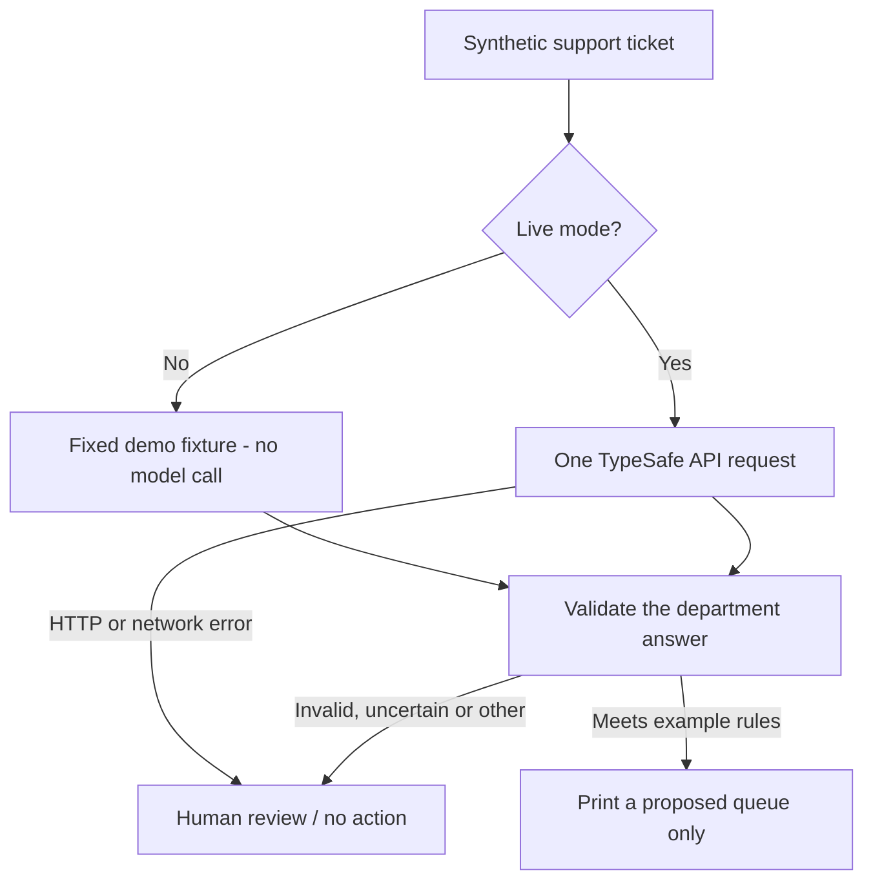

# Start with Jev / 从零认识 Jev

[English](#english) · [中文](#中文) · [Home](../README.md)

## English

### 1. The mental model

You write a question and define the answer space. Jev evaluates it against the state you supply. Your application consumes the answer and decides what happens next. It does not automatically browse a repository, operate your browser, or authorize an action. Those are responsibilities of the application around the model.

For a support ticket, **Choice** can select `billing`, `technical`, or `other`; **Score** can locate the message on an ordered frustration rubric; **Noul** can estimate whether the customer explicitly describes urgency. A Noul of 0.5 indicates uncertainty about a yes/no condition, not medium severity. Score can fall between levels. Noul has no separate confidence field. See the official [introduction](https://docs.typesafe.ai/introduction) and [primitives](https://docs.typesafe.ai/primitives).

Questions in one request see the same state independently. Asking several questions in parallel is different from running several research Agents. A question cannot use another answer from the same request as hidden context; a real dependency belongs in a later request. See [question composition](https://docs.typesafe.ai/primitives#when-one-question-depends-on-another).

### 2. Run the first example

Follow the [ticket-routing walkthrough](../examples/README.md#english). The first command works offline. Live mode is a separate, explicit opt-in. The example sends all three question types in one request, but only the department Choice controls the proposed queue. Frustration and urgency are printed for inspection, not used as autonomous action permissions.

### 3. Choose the simplest tool for the job

Use ordinary code for exact arithmetic, counting, dates, authorization, and deterministic business rules. A traditional classifier can be a useful baseline for a stable, narrow labeling task. A generative model fits tasks whose required output is new text. Jev is worth evaluating when the useful result is a bounded semantic judgment that your code will consume. These are design choices, not claims that one model wins every task.

The official [Jev 1.13 limitations](https://docs.typesafe.ai/model-jaggedness/jev-1.13) describe problems with numeric precision, dates, indirect questions, distracting context, adversarial inputs, and text generation. This is a version-specific source, not a claim about every future model.

### 4. Before connecting it to a real workflow

Keep questions narrow, make criteria mutually understandable, and include an `other` option when coverage is incomplete. Treat the evaluated content as untrusted data. Validate the fields your code consumes, retain a fallback path, and keep execution permissions outside the model.

Create labeled task examples, reserve a held-out test set, and choose thresholds on separate development data. Measure errors, abstentions, latency, and cost under the same conditions as your baseline. Include ambiguous, out-of-scope, multilingual, and adversarial examples. Record the model identifier and date; `jev-latest` can change. Offline tests of routing code do not measure model quality.

The official [confidence documentation](https://docs.typesafe.ai/confidence) describes confidence as a statistic of a probability distribution. Do not interpret the tutorial’s threshold as a calibrated probability of being correct. Interfaces, independent implementations, and official weights are different things; compatibility alone does not prove equivalent behavior.

## 中文

### 1. 先理解谁负责什么

你定义问题和可选答案，Jev 根据提供的状态进行判断，应用代码决定如何使用结果。浏览仓库、操作浏览器、批准执行，都需要外围程序实现，不会因为调用 Jev 自动发生。

用一张工单理解三种问题：**Choice** 选择 `billing`、`technical` 或 `other`；**Score** 按“平静、烦躁、生气”等有序标准评分；**Noul** 判断消息是否明确表达紧急性。Noul 为 0.5 表示对一个是非条件不确定，不表示事情“中等严重”。Score 可以是小数，Noul 没有单独的 confidence 字段。参考[官方介绍](https://docs.typesafe.ai/introduction)和[基础问题说明](https://docs.typesafe.ai/primitives)。

同一次请求中的问题独立读取同一份状态。**并行回答问题与并行运行研究 Agent 是两件事。** 一个问题不能隐式读取同次请求中另一个问题的答案；确实存在结果依赖时，由代码发起后续请求。参考[问题依赖说明](https://docs.typesafe.ai/primitives#when-one-question-depends-on-another)。

### 2. 跑通第一个例子

打开[工单路由示例](../examples/README.md#中文)。先运行不需要密钥的离线模式，再显式启用真实 API。示例一次发送三种问题，但只有 department 的 Choice 用于队列建议；情绪评分和紧急概率只用于观察，不用于授权操作。

流程图见上方：演示数据或真实响应 → 校验 department → 打印建议，或回退到人工复核。任何路径都不会真的移动工单、退款或调用外部执行工具。

### 3. 什么情况下不需要 Jev？

精确计算、计数、日期比较、权限控制和确定性的业务规则，优先交给代码。稳定而单一的分类任务，可以加入传统分类器作为对照。需要生成新文字时，使用生成模型。需要将有界的语义判断直接交给程序消费时，再评估 Jev。这里给的是选型思路，没有宣称某个模型在所有任务上更好。

官方 [Jev 1.13 局限说明](https://docs.typesafe.ai/model-jaggedness/jev-1.13)列出了数值、日期、间接问题、无关上下文、对抗输入和文字生成等问题。这份说明对应特定版本，不能推断所有后续版本都相同。

### 4. 接入真实业务之前

每个问题只问一件事；选项覆盖不足时设置 `other`；将待判断内容当作不可信数据；校验代码真正使用的字段；保留超时、失败与低确定性的回退路径。执行授权留在程序和业务制度中。

准备有标注的任务样本，用开发集选择阈值，再用独立测试集评估。记录错误、拒答/回退比例、延迟、费用以及同条件下的对照结果。加入歧义、超出范围、多语言和对抗输入。记录模型版本和日期，`jev-latest` 可能变化。离线单元测试只能证明程序行为，不能证明模型准确率。

官方[置信度文档](https://docs.typesafe.ai/confidence)将 confidence 解释为概率分布的统计量。示例阈值不是经过校准的正确率保证。接口兼容、独立实现、官方模型权重也不是同一个概念，不能把“能调用”写成“效果相同”。

## Next / 下一步

[SDK 与接入](../README_zh.md#sdk-与接入) · [路由实践](../patterns/routing.md) · [评分实践](../patterns/scoring.md)

API and conceptual references checked on 2026-09-20. Live API execution and project benchmarks were not performed for this guide.
